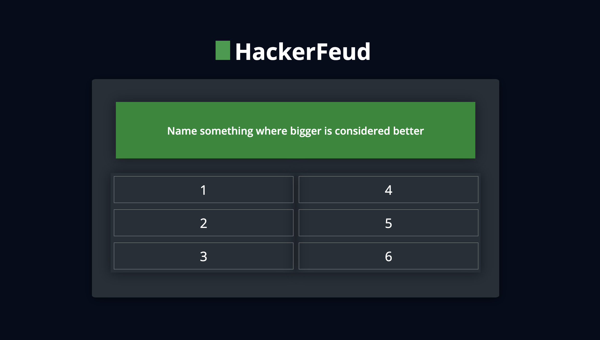
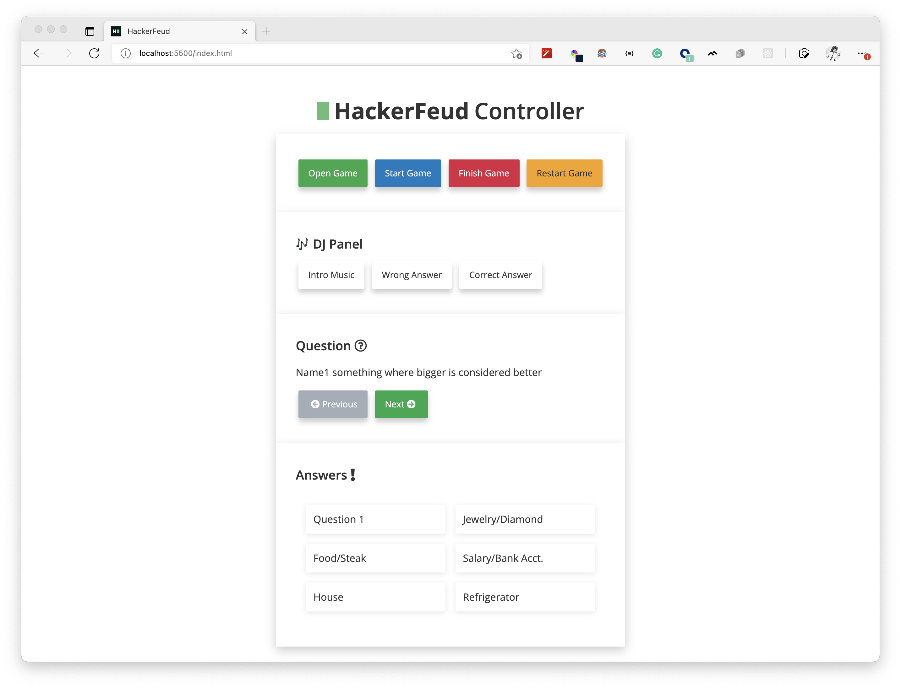

# 🟩 HackerFeud 
A mock-off family-feud game for having some fun during happy hours 🎉

### View Live Demo
<pre><a href="#"><-your-subdomain->.hackerrank.com</a></pre>

## Project Overview
A HackerFeud game featuring a moderator view and a contestant view. HackerRankers compete to name the most popular responses to survey questions <b>in order to win <s>cash and prizes</s> our blessings 😛</b>. The moderator panel can control the sounds, effects, answers, points and questions.

### Screenshots ?

<b>Controller : </b> Only the controller master should see this :)

<b>Game Board :</b> You can share this tab with folks on a zoom call, and ask them to guess the answers!

### Project Structure & Code Quality
<b>Don't, just don't..</b> even try looking at the code. We literally made this when we were asleep (or really-really tired, our eyelashes were dropping and we were out of Maggi that night). If Aakansha Ma'am looks at this code, we're going to get fired 🥲